# Karn Protocol - Architecture Diagrams

**Version**: 1.0.0
**Last Updated**: 2026-02-07

This document provides visual architecture diagrams for Karn Protocol using Mermaid syntax.

## Table of Contents

1. [System Architecture](#system-architecture)
2. [Contract Architecture](#contract-architecture)
3. [Data Flow Diagrams](#data-flow-diagrams)
4. [Deployment Architecture](#deployment-architecture)
5. [User Flows](#user-flows)
6. [Sequence Diagrams](#sequence-diagrams)

---

# System Architecture

## High-Level System Architecture

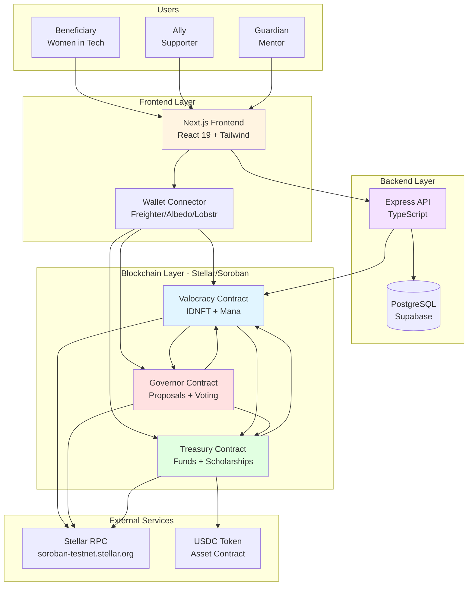
```mermaid
graph TB
    subgraph "Users"
        U1[Beneficiary<br/>Women in Tech]
        U2[Ally<br/>Supporter]
        U3[Guardian<br/>Mentor]
    end

    subgraph "Frontend Layer"
        FE[Next.js Frontend<br/>React 19 + Tailwind]
        WC[Wallet Connector<br/>Freighter/Albedo/Lobstr]
    end

    subgraph "Backend Layer"
        API[Express API<br/>TypeScript]
        DB[(PostgreSQL<br/>Supabase)]
    end

    subgraph "Blockchain Layer - Stellar/Soroban"
        VAL[Valocracy Contract<br/>IDNFT + Mana]
        GOV[Governor Contract<br/>Proposals + Voting]
        TRE[Treasury Contract<br/>Funds + Scholarships]
    end

    subgraph "External Services"
        RPC[Stellar RPC<br/>soroban-testnet.stellar.org]
        USDC[USDC Token<br/>Asset Contract]
    end

    U1 & U2 & U3 --> FE
    FE --> WC
    FE --> API
    WC --> VAL & GOV & TRE
    API --> DB
    API --> VAL
    VAL --> GOV
    VAL --> TRE
    GOV --> VAL
    GOV --> TRE
    TRE --> VAL
    TRE --> USDC
    VAL & GOV & TRE --> RPC

    style VAL fill:#e1f5ff
    style GOV fill:#ffe1e1
    style TRE fill:#e1ffe1
    style FE fill:#fff4e1
    style API fill:#f4e1ff
```

## Technology Stack

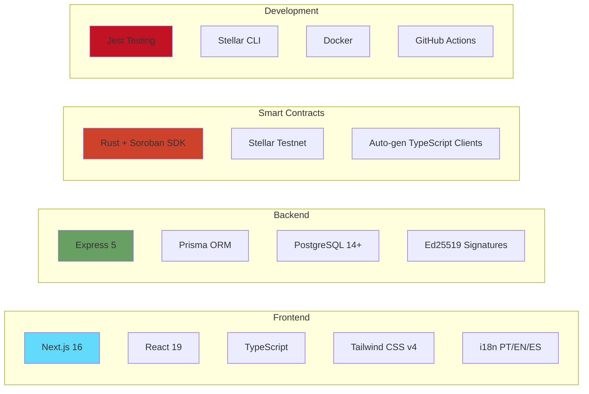
```mermaid
graph LR
    subgraph "Frontend"
        A1[Next.js 16]
        A2[React 19]
        A3[TypeScript]
        A4[Tailwind CSS v4]
        A5[i18n PT/EN/ES]
    end

    subgraph "Backend"
        B1[Express 5]
        B2[Prisma ORM]
        B3[PostgreSQL 14+]
        B4[Ed25519 Signatures]
    end

    subgraph "Smart Contracts"
        C1[Rust + Soroban SDK]
        C2[Stellar Testnet]
        C3[Auto-gen TypeScript Clients]
    end

    subgraph "Development"
        D1[Jest Testing]
        D2[Stellar CLI]
        D3[Docker]
        D4[GitHub Actions]
    end

    style A1 fill:#61dafb
    style B1 fill:#68a063
    style C1 fill:#ce422b
    style D1 fill:#c21325
```

---

# Contract Architecture

## Contract Interaction Diagram

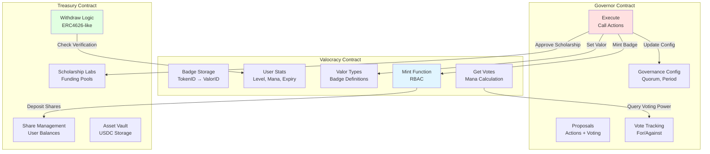
```mermaid
graph TB
    subgraph "Valocracy Contract"
        V1[Badge Storage<br/>TokenID → ValorID]
        V2[User Stats<br/>Level, Mana, Expiry]
        V3[Valor Types<br/>Badge Definitions]
        V4[Mint Function<br/>RBAC]
        V5[Get Votes<br/>Mana Calculation]
    end

    subgraph "Governor Contract"
        G1[Proposals<br/>Actions + Voting]
        G2[Vote Tracking<br/>For/Against]
        G3[Governance Config<br/>Quorum, Period]
        G4[Execute<br/>Call Actions]
    end

    subgraph "Treasury Contract"
        T1[Share Management<br/>User Balances]
        T2[Asset Vault<br/>USDC Storage]
        T3[Scholarship Labs<br/>Funding Pools]
        T4[Withdraw Logic<br/>ERC4626-like]
    end

    V5 -->|Query Voting Power| G2
    G4 -->|Mint Badge| V4
    G4 -->|Set Valor| V3
    G4 -->|Update Config| G3
    G4 -->|Approve Scholarship| T3
    V4 -->|Deposit Shares| T1
    T4 -->|Check Verification| V2

    style V4 fill:#e1f5ff
    style G4 fill:#ffe1e1
    style T4 fill:#e1ffe1
```

## Badge Category Hierarchy

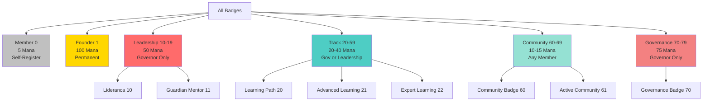
```mermaid
graph TD
    ROOT[All Badges]

    ROOT --> M[Member 0<br/>5 Mana<br/>Self-Register]
    ROOT --> F[Founder 1<br/>100 Mana<br/>Permanent]
    ROOT --> L[Leadership 10-19<br/>50 Mana<br/>Governor Only]
    ROOT --> T[Track 20-59<br/>20-40 Mana<br/>Gov or Leadership]
    ROOT --> C[Community 60-69<br/>10-15 Mana<br/>Any Member]
    ROOT --> G[Governance 70-79<br/>75 Mana<br/>Governor Only]

    L --> L1[Lideranca 10]
    L --> L2[Guardian Mentor 11]

    T --> T1[Learning Path 20]
    T --> T2[Advanced Learning 21]
    T --> T3[Expert Learning 22]

    C --> C1[Community Badge 60]
    C --> C2[Active Community 61]

    G --> G1[Governance Badge 70]

    style F fill:#ffd700
    style M fill:#c0c0c0
    style L fill:#ff6b6b
    style T fill:#4ecdc4
    style C fill:#95e1d3
    style G fill:#f38181
```

## Access Control Matrix

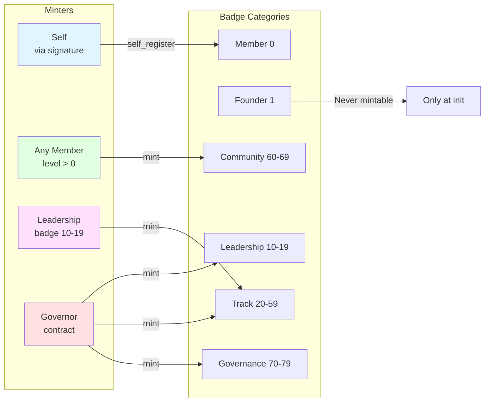
```mermaid
graph LR
    subgraph "Minters"
        SELF[Self<br/>via signature]
        MEMBER[Any Member<br/>level > 0]
        LEAD[Leadership<br/>badge 10-19]
        GOVERNOR[Governor<br/>contract]
    end

    subgraph "Badge Categories"
        B0[Member 0]
        B1[Founder 1]
        B10[Leadership 10-19]
        B20[Track 20-59]
        B60[Community 60-69]
        B70[Governance 70-79]
    end

    SELF -->|self_register| B0
    B1 -.->|Never mintable| INIT[Only at init]
    GOVERNOR -->|mint| B10
    GOVERNOR -->|mint| B20
    LEAD -->|mint| B20
    MEMBER -->|mint| B60
    GOVERNOR -->|mint| B70

    style SELF fill:#e1f5ff
    style GOVERNOR fill:#ffe1e1
    style LEAD fill:#ffe1ff
    style MEMBER fill:#e1ffe1
```

---

# Data Flow Diagrams

## User Registration Flow

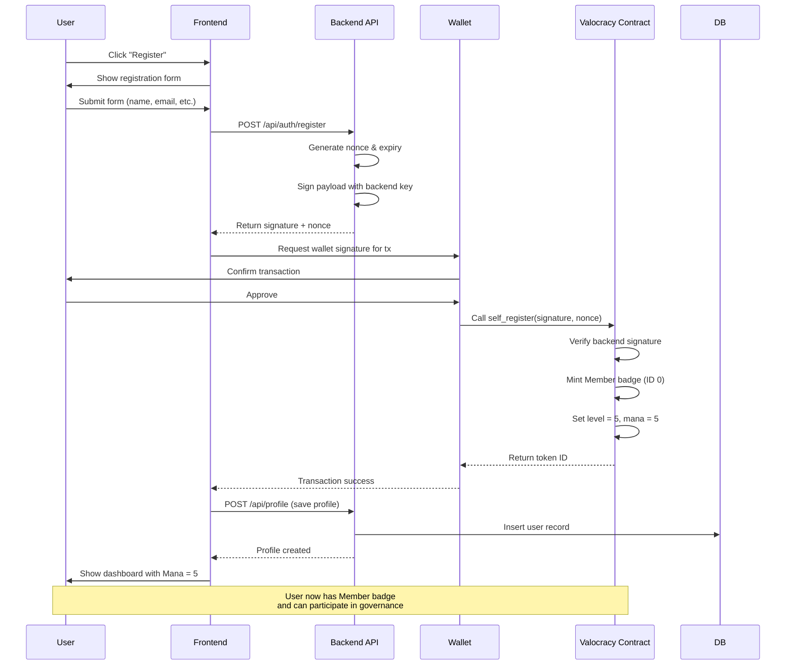
```mermaid
sequenceDiagram
    participant U as User
    participant FE as Frontend
    participant API as Backend API
    participant W as Wallet
    participant V as Valocracy Contract

    U->>FE: Click "Register"
    FE->>U: Show registration form
    U->>FE: Submit form (name, email, etc.)
    FE->>API: POST /api/auth/register
    API->>API: Generate nonce & expiry
    API->>API: Sign payload with backend key
    API-->>FE: Return signature + nonce
    FE->>W: Request wallet signature for tx
    W->>U: Confirm transaction
    U->>W: Approve
    W->>V: Call self_register(signature, nonce)
    V->>V: Verify backend signature
    V->>V: Mint Member badge (ID 0)
    V->>V: Set level = 5, mana = 5
    V-->>W: Return token ID
    W-->>FE: Transaction success
    FE->>API: POST /api/profile (save profile)
    API->>DB: Insert user record
    API-->>FE: Profile created
    FE->>U: Show dashboard with Mana = 5

    Note over U,V: User now has Member badge<br/>and can participate in governance
```

## Governance Proposal Flow

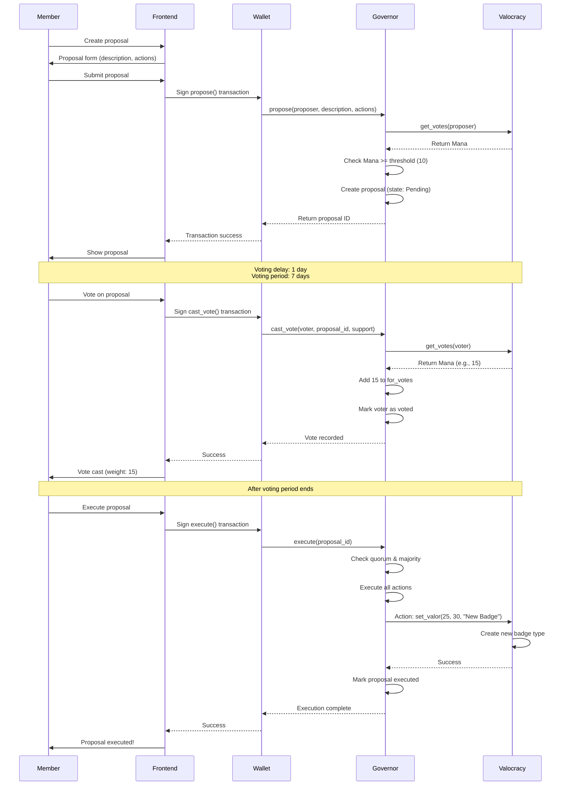
```mermaid
sequenceDiagram
    participant M as Member
    participant FE as Frontend
    participant W as Wallet
    participant G as Governor
    participant V as Valocracy

    M->>FE: Create proposal
    FE->>M: Proposal form (description, actions)
    M->>FE: Submit proposal
    FE->>W: Sign propose() transaction
    W->>G: propose(proposer, description, actions)
    G->>V: get_votes(proposer)
    V-->>G: Return Mana
    G->>G: Check Mana >= threshold (10)
    G->>G: Create proposal (state: Pending)
    G-->>W: Return proposal ID
    W-->>FE: Transaction success
    FE->>M: Show proposal #1 created

    Note over M,V: Voting delay: 1 day<br/>Voting period: 7 days

    M->>FE: Vote on proposal
    FE->>W: Sign cast_vote() transaction
    W->>G: cast_vote(voter, proposal_id, support)
    G->>V: get_votes(voter)
    V-->>G: Return Mana (e.g., 15)
    G->>G: Add 15 to for_votes
    G->>G: Mark voter as voted
    G-->>W: Vote recorded
    W-->>FE: Success
    FE->>M: Vote cast (weight: 15)

    Note over M,V: After voting period ends

    M->>FE: Execute proposal
    FE->>W: Sign execute() transaction
    W->>G: execute(proposal_id)
    G->>G: Check quorum & majority
    G->>G: Execute all actions
    G->>V: Action: set_valor(25, 30, "New Badge")
    V->>V: Create new badge type
    V-->>G: Success
    G->>G: Mark proposal executed
    G-->>W: Execution complete
    W-->>FE: Success
    FE->>M: Proposal executed!
```

## Scholarship Flow

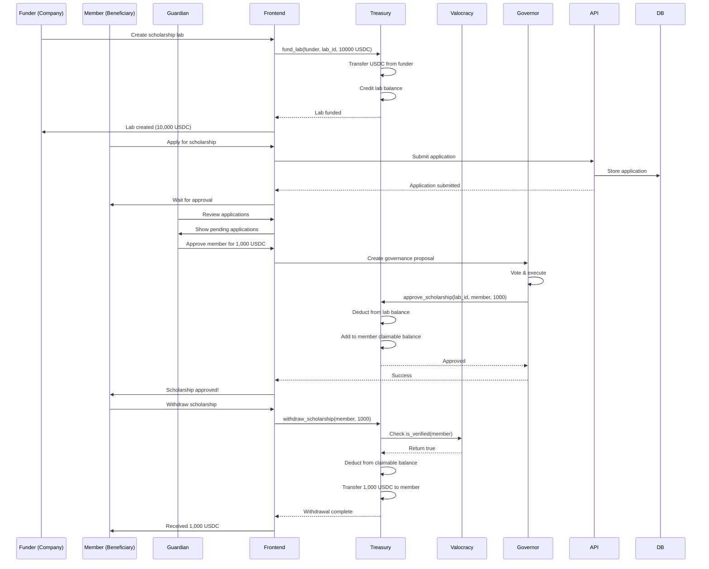
```mermaid
sequenceDiagram
    participant F as Funder (Company)
    participant M as Member (Beneficiary)
    participant G as Guardian
    participant FE as Frontend
    participant T as Treasury
    participant V as Valocracy
    participant GOV as Governor

    F->>FE: Create scholarship lab
    FE->>T: fund_lab(funder, lab_id, 10000 USDC)
    T->>T: Transfer USDC from funder
    T->>T: Credit lab balance
    T-->>FE: Lab funded
    FE->>F: Lab created (10,000 USDC)

    M->>FE: Apply for scholarship
    FE->>API: Submit application
    API->>DB: Store application
    API-->>FE: Application submitted
    FE->>M: Wait for approval

    G->>FE: Review applications
    FE->>G: Show pending applications
    G->>FE: Approve member for 1,000 USDC
    FE->>GOV: Create governance proposal
    GOV->>GOV: Vote & execute
    GOV->>T: approve_scholarship(lab_id, member, 1000)
    T->>T: Deduct from lab balance
    T->>T: Add to member claimable balance
    T-->>GOV: Approved
    GOV-->>FE: Success
    FE->>M: Scholarship approved!

    M->>FE: Withdraw scholarship
    FE->>T: withdraw_scholarship(member, 1000)
    T->>V: Check is_verified(member)
    V-->>T: Return true
    T->>T: Deduct from claimable balance
    T->>T: Transfer 1,000 USDC to member
    T-->>FE: Withdrawal complete
    FE->>M: Received 1,000 USDC
```

## Mana Decay Calculation

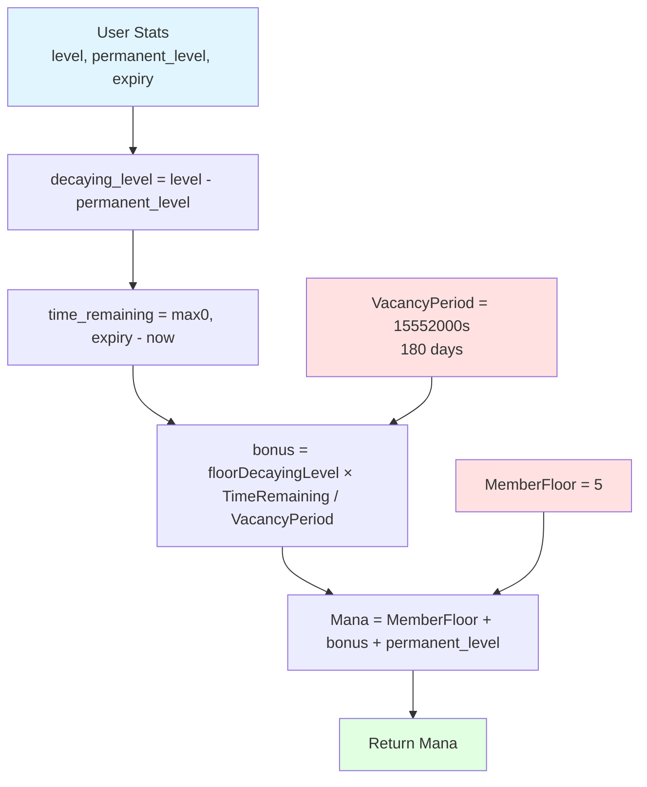
```mermaid
graph TB
    START[User Stats<br/>level, permanent_level, expiry]

    START --> CALC1[decaying_level = level - permanent_level]
    CALC1 --> CALC2[time_remaining = max0, expiry - now]
    CALC2 --> CALC3[bonus = floorDecayingLevel × TimeRemaining / VacancyPeriod]
    CALC3 --> CALC4[Mana = MemberFloor + bonus + permanent_level]
    CALC4 --> END[Return Mana]

    CONST1[MemberFloor = 5]
    CONST2[VacancyPeriod = 15552000s<br/>180 days]

    CONST1 --> CALC4
    CONST2 --> CALC3

    style START fill:#e1f5ff
    style END fill:#e1ffe1
    style CONST1 fill:#ffe1e1
    style CONST2 fill:#ffe1e1
```

---

# Deployment Architecture

## Production Deployment

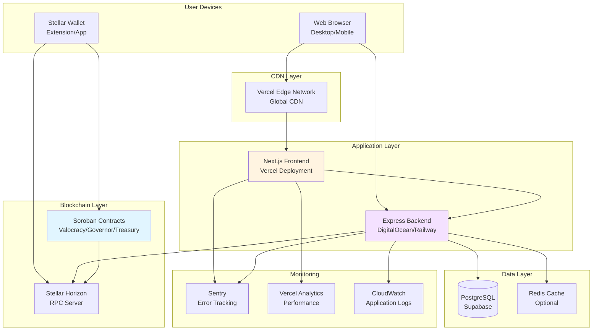
```mermaid
graph TB
    subgraph "User Devices"
        BROWSER[Web Browser<br/>Desktop/Mobile]
        WALLET[Stellar Wallet<br/>Extension/App]
    end

    subgraph "CDN Layer"
        CDN[Vercel Edge Network<br/>Global CDN]
    end

    subgraph "Application Layer"
        FE[Next.js Frontend<br/>Vercel Deployment]
        API[Express Backend<br/>DigitalOcean/Railway]
    end

    subgraph "Data Layer"
        DB[(PostgreSQL<br/>Supabase)]
        CACHE[Redis Cache<br/>Optional]
    end

    subgraph "Blockchain Layer"
        HORIZON[Stellar Horizon<br/>RPC Server]
        CONTRACTS[Soroban Contracts<br/>Valocracy/Governor/Treasury]
    end

    subgraph "Monitoring"
        SENTRY[Sentry<br/>Error Tracking]
        VERCEL_ANALYTICS[Vercel Analytics<br/>Performance]
        LOGS[CloudWatch<br/>Application Logs]
    end

    BROWSER --> CDN
    WALLET --> HORIZON
    CDN --> FE
    BROWSER --> API
    FE --> API
    API --> DB
    API --> CACHE
    API --> HORIZON
    WALLET --> CONTRACTS
    CONTRACTS --> HORIZON

    FE --> SENTRY
    API --> SENTRY
    FE --> VERCEL_ANALYTICS
    API --> LOGS

    style FE fill:#fff4e1
    style API fill:#f4e1ff
    style CONTRACTS fill:#e1f5ff
```

## Development Environment

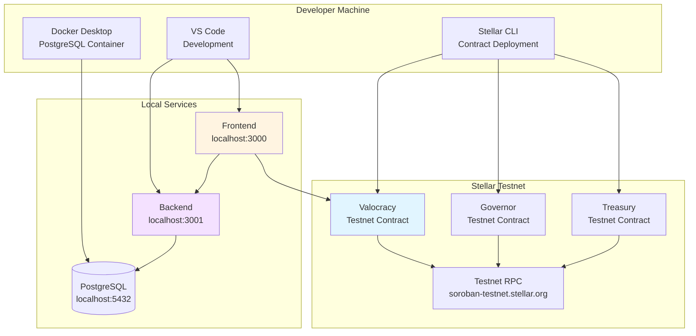
```mermaid
graph TB
    subgraph "Developer Machine"
        IDE[VS Code<br/>Development]
        DOCKER[Docker Desktop<br/>PostgreSQL Container]
        STELLAR_CLI[Stellar CLI<br/>Contract Deployment]
    end

    subgraph "Local Services"
        FE_LOCAL[Frontend<br/>localhost:3000]
        API_LOCAL[Backend<br/>localhost:3001]
        DB_LOCAL[(PostgreSQL<br/>localhost:5432)]
    end

    subgraph "Stellar Testnet"
        TESTNET_RPC[Testnet RPC<br/>soroban-testnet.stellar.org]
        VAL_TEST[Valocracy<br/>Testnet Contract]
        GOV_TEST[Governor<br/>Testnet Contract]
        TRE_TEST[Treasury<br/>Testnet Contract]
    end

    IDE --> FE_LOCAL
    IDE --> API_LOCAL
    DOCKER --> DB_LOCAL
    STELLAR_CLI --> VAL_TEST
    STELLAR_CLI --> GOV_TEST
    STELLAR_CLI --> TRE_TEST

    FE_LOCAL --> API_LOCAL
    API_LOCAL --> DB_LOCAL
    FE_LOCAL --> VAL_TEST
    VAL_TEST --> TESTNET_RPC
    GOV_TEST --> TESTNET_RPC
    TRE_TEST --> TESTNET_RPC

    style FE_LOCAL fill:#fff4e1
    style API_LOCAL fill:#f4e1ff
    style VAL_TEST fill:#e1f5ff
```

## Continuous Integration/Deployment

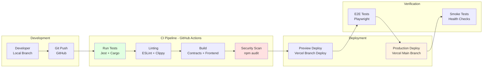
```mermaid
graph LR
    subgraph "Development"
        DEV[Developer<br/>Local Branch]
        GIT[Git Push<br/>GitHub]
    end

    subgraph "CI Pipeline - GitHub Actions"
        TEST[Run Tests<br/>Jest + Cargo]
        LINT[Linting<br/>ESLint + Clippy]
        BUILD[Build<br/>Contracts + Frontend]
        SECURITY[Security Scan<br/>npm audit]
    end

    subgraph "Deployment"
        PREVIEW[Preview Deploy<br/>Vercel Branch Deploy]
        PROD[Production Deploy<br/>Vercel Main Branch]
    end

    subgraph "Verification"
        E2E[E2E Tests<br/>Playwright]
        SMOKE[Smoke Tests<br/>Health Checks]
    end

    DEV --> GIT
    GIT --> TEST
    TEST --> LINT
    LINT --> BUILD
    BUILD --> SECURITY
    SECURITY --> PREVIEW
    PREVIEW --> E2E
    E2E --> PROD
    PROD --> SMOKE

    style TEST fill:#e1ffe1
    style SECURITY fill:#ffe1e1
    style PROD fill:#fff4e1
```

---

# User Flows

## Complete User Journey

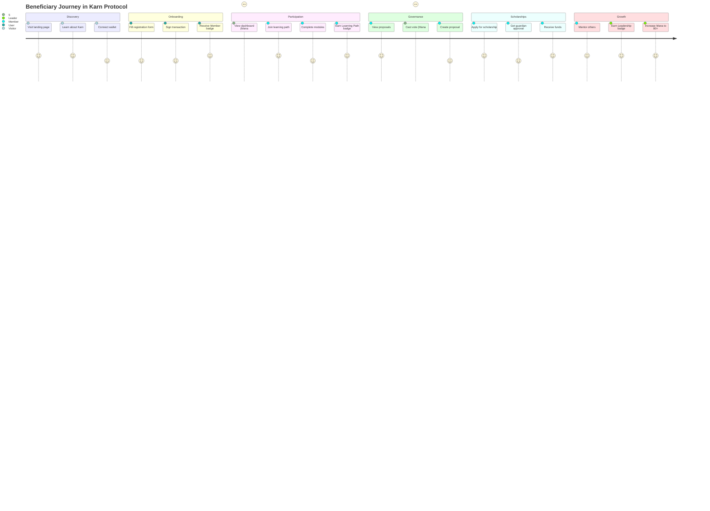
```mermaid
journey
    title Beneficiary Journey in Karn Protocol
    section Discovery
      Visit landing page: 5: Visitor
      Learn about Karn: 5: Visitor
      Connect wallet: 4: Visitor
    section Onboarding
      Fill registration form: 4: User
      Sign transaction: 4: User
      Receive Member badge: 5: User
    section Participation
      View dashboard (Mana: 5): 5: Member
      Join learning path: 5: Member
      Complete modules: 4: Member
      Earn Learning Path badge: 5: Member
    section Governance
      View proposals: 5: Member
      Cast vote (Mana: 25): 5: Member
      Create proposal: 4: Member
    section Scholarships
      Apply for scholarship: 5: Member
      Get guardian approval: 4: Member
      Receive funds: 5: Member
    section Growth
      Mentor others: 5: Member
      Earn Leadership badge: 5: Leader
      Increase Mana to 80+: 5: Leader
```

## Badge Earning Flow

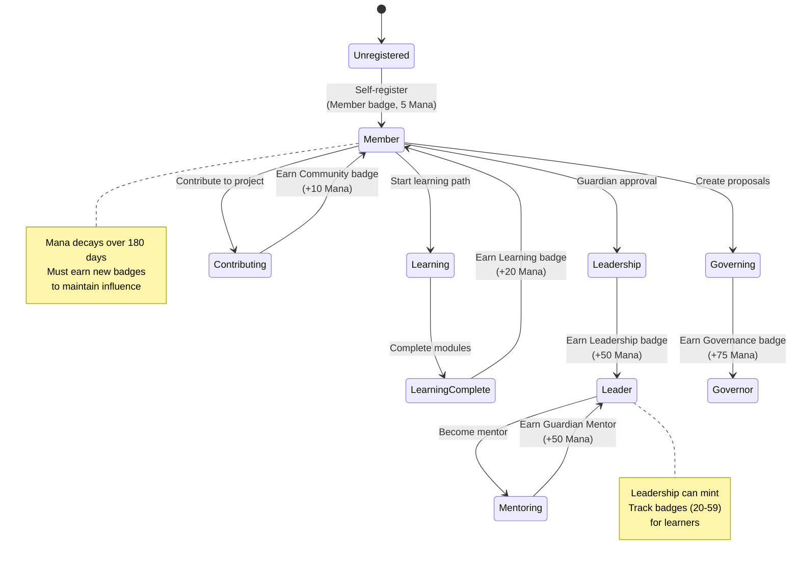
```mermaid
stateDiagram-v2
    [*] --> Unregistered
    Unregistered --> Member: Self-register<br/>(Member badge, 5 Mana)

    Member --> Learning: Start learning path
    Learning --> LearningComplete: Complete modules
    LearningComplete --> Member: Earn Learning badge<br/>(+20 Mana)

    Member --> Contributing: Contribute to project
    Contributing --> Member: Earn Community badge<br/>(+10 Mana)

    Member --> Leadership: Guardian approval
    Leadership --> Leader: Earn Leadership badge<br/>(+50 Mana)

    Leader --> Mentoring: Become mentor
    Mentoring --> Leader: Earn Guardian Mentor<br/>(+50 Mana)

    Member --> Governing: Create proposals
    Governing --> Governor: Earn Governance badge<br/>(+75 Mana)

    note right of Member
        Mana decays over 180 days
        Must earn new badges
        to maintain influence
    end note

    note right of Leader
        Leadership can mint
        Track badges (20-59)
        for learners
    end note
```

---

# Sequence Diagrams

## Cross-Contract Governance Example

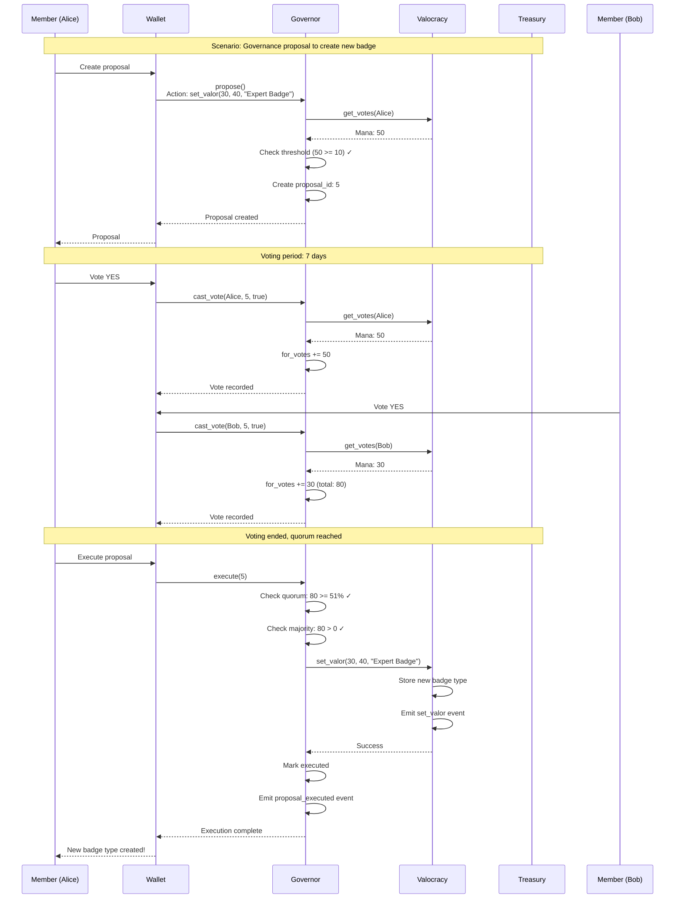
```mermaid
sequenceDiagram
    participant M as Member (Alice)
    participant W as Wallet
    participant G as Governor
    participant V as Valocracy
    participant T as Treasury

    Note over M,T: Scenario: Governance proposal to create new badge

    M->>W: Create proposal
    W->>G: propose()<br/>Action: set_valor(30, 40, "Expert Badge")
    G->>V: get_votes(Alice)
    V-->>G: Mana: 50
    G->>G: Check threshold (50 >= 10) ✓
    G->>G: Create proposal_id: 5
    G-->>W: Proposal created
    W-->>M: Proposal #5 active

    Note over M,T: Voting period: 7 days

    M->>W: Vote YES
    W->>G: cast_vote(Alice, 5, true)
    G->>V: get_votes(Alice)
    V-->>G: Mana: 50
    G->>G: for_votes += 50
    G-->>W: Vote recorded

    participant M2 as Member (Bob)
    M2->>W: Vote YES
    W->>G: cast_vote(Bob, 5, true)
    G->>V: get_votes(Bob)
    V-->>G: Mana: 30
    G->>G: for_votes += 30 (total: 80)
    G-->>W: Vote recorded

    Note over M,T: Voting ended, quorum reached

    M->>W: Execute proposal
    W->>G: execute(5)
    G->>G: Check quorum: 80 >= 51% ✓
    G->>G: Check majority: 80 > 0 ✓
    G->>V: set_valor(30, 40, "Expert Badge")
    V->>V: Store new badge type
    V->>V: Emit set_valor event
    V-->>G: Success
    G->>G: Mark executed
    G->>G: Emit proposal_executed event
    G-->>W: Execution complete
    W-->>M: New badge type created!
```

## Wallet Connection Flow

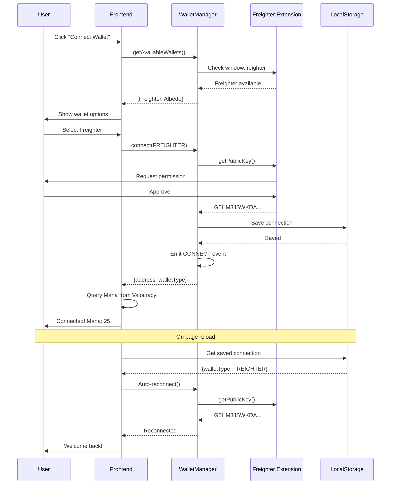
```mermaid
sequenceDiagram
    participant U as User
    participant FE as Frontend
    participant WM as WalletManager
    participant FR as Freighter Extension
    participant LS as LocalStorage

    U->>FE: Click "Connect Wallet"
    FE->>WM: getAvailableWallets()
    WM->>FR: Check window.freighter
    FR-->>WM: Freighter available
    WM-->>FE: [Freighter, Albedo]
    FE->>U: Show wallet options

    U->>FE: Select Freighter
    FE->>WM: connect(FREIGHTER)
    WM->>FR: getPublicKey()
    FR->>U: Request permission
    U->>FR: Approve
    FR-->>WM: G5HM3JSWKDA...
    WM->>LS: Save connection
    LS-->>WM: Saved
    WM->>WM: Emit CONNECT event
    WM-->>FE: {address, walletType}
    FE->>FE: Query Mana from Valocracy
    FE->>U: Connected! Mana: 25

    Note over U,LS: On page reload

    FE->>LS: Get saved connection
    LS-->>FE: {walletType: FREIGHTER}
    FE->>WM: Auto-reconnect()
    WM->>FR: getPublicKey()
    FR-->>WM: G5HM3JSWKDA...
    WM-->>FE: Reconnected
    FE->>U: Welcome back!
```

---

# Component Architecture

## Frontend Component Hierarchy

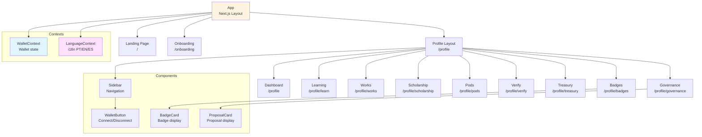
```mermaid
graph TB
    ROOT[App<br/>Next.js Layout]

    ROOT --> LANDING[Landing Page<br/>/]
    ROOT --> ONBOARD[Onboarding<br/>/onboarding]
    ROOT --> PROFILE[Profile Layout<br/>/profile]

    PROFILE --> DASH[Dashboard<br/>/profile]
    PROFILE --> BADGES[Badges<br/>/profile/badges]
    PROFILE --> GOV[Governance<br/>/profile/governance]
    PROFILE --> LEARN[Learning<br/>/profile/learn]
    PROFILE --> WORKS[Works<br/>/profile/works]
    PROFILE --> SCHOLAR[Scholarship<br/>/profile/scholarship]
    PROFILE --> PODS[Pods<br/>/profile/pods]
    PROFILE --> VERIFY[Verify<br/>/profile/verify]
    PROFILE --> TRES[Treasury<br/>/profile/treasury]

    subgraph "Contexts"
        CTX1[WalletContext<br/>Wallet state]
        CTX2[LanguageContext<br/>i18n PT/EN/ES]
    end

    subgraph "Components"
        COMP1[Sidebar<br/>Navigation]
        COMP2[WalletButton<br/>Connect/Disconnect]
        COMP3[BadgeCard<br/>Badge display]
        COMP4[ProposalCard<br/>Proposal display]
    end

    ROOT --> CTX1
    ROOT --> CTX2
    PROFILE --> COMP1
    COMP1 --> COMP2
    BADGES --> COMP3
    GOV --> COMP4

    style ROOT fill:#fff4e1
    style CTX1 fill:#e1f5ff
    style CTX2 fill:#ffe1ff
```

## Backend API Routes

```mermaid
graph TB
    API[Express API<br/>Port 3001]

    API --> AUTH[/api/auth<br/>Registration signatures]
    API --> PROFILE[/api/profile<br/>User CRUD]
    API --> ADMIN[/api/admin<br/>Guardian approvals]
    API --> VOUCH[/api/vouch<br/>Vouching system]
    API --> VERIFY[/api/verification<br/>Identity verification]
    API --> LABS[/api/labs<br/>Scholarship labs]
    API --> LEARN[/api/learning<br/>Learning paths]
    API --> BOUNTY[/api/bounties<br/>Karn Works]
    API --> BADGE[/api/badges<br/>Badge metadata]

    subgraph "Middleware"
        MW1[verifySignature<br/>Ed25519 verification]
        MW2[rateLimiter<br/>100 req/15min]
        MW3[cors<br/>Domain whitelist]
    end

    AUTH --> MW1
    PROFILE --> MW1
    API --> MW2
    API --> MW3

    subgraph "Database"
        DB1[(Users)]
        DB2[(Vouches)]
        DB3[(Labs)]
        DB4[(LearningPaths)]
        DB5[(Bounties)]
    end

    PROFILE --> DB1
    VOUCH --> DB2
    LABS --> DB3
    LEARN --> DB4
    BOUNTY --> DB5

    style API fill:#f4e1ff
    style MW1 fill:#ffe1e1
```

---

# State Management

## Frontend State Flow

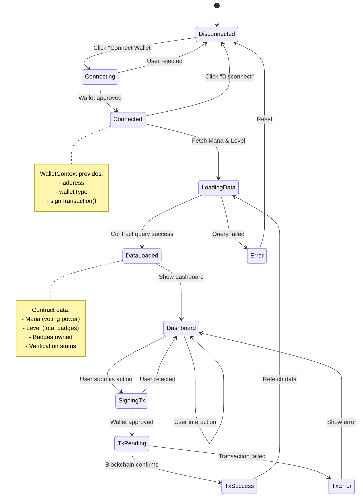
```mermaid
stateDiagram-v2
    [*] --> Disconnected

    Disconnected --> Connecting: Click "Connect Wallet"
    Connecting --> Connected: Wallet approved
    Connecting --> Disconnected: User rejected

    Connected --> LoadingData: Fetch Mana & Level
    LoadingData --> DataLoaded: Contract query success
    LoadingData --> Error: Query failed

    DataLoaded --> Dashboard: Show dashboard
    Dashboard --> Dashboard: User interaction

    Dashboard --> SigningTx: User submits action
    SigningTx --> TxPending: Wallet approved
    SigningTx --> Dashboard: User rejected

    TxPending --> TxSuccess: Blockchain confirms
    TxPending --> TxError: Transaction failed

    TxSuccess --> LoadingData: Refetch data
    TxError --> Dashboard: Show error

    Connected --> Disconnected: Click "Disconnect"
    Error --> Disconnected: Reset

    note right of Connected
        WalletContext provides:
        - address
        - walletType
        - signTransaction()
    end note

    note right of DataLoaded
        Contract data:
        - Mana (voting power)
        - Level (total badges)
        - Badges owned
        - Verification status
    end note
```

---

# Summary

This document provides comprehensive architecture diagrams for Karn Protocol including:

✅ **System Architecture** — High-level overview and technology stack
✅ **Contract Architecture** — Contract interactions, badge hierarchy, access control
✅ **Data Flow Diagrams** — Registration, governance, scholarships, Mana calculation
✅ **Deployment Architecture** — Production, development, CI/CD pipelines
✅ **User Flows** — Complete user journey and state machines
✅ **Sequence Diagrams** — Cross-contract interactions and wallet flows
✅ **Component Architecture** — Frontend components and backend routes
✅ **State Management** — Frontend state flow

All diagrams use Mermaid syntax and can be rendered in:
- GitHub README files
- Markdown viewers with Mermaid support
- Mermaid Live Editor (mermaid.live)
- Documentation sites (GitBook, MkDocs, etc.)

---

**Architecture Diagrams Version**: 1.0.0
**Last Updated**: 2026-02-07
**Maintained By**: Karn Protocol Team
